# 📬 Modern Contact Form - Complete Web Application

Sebuah sistem contact form modern yang dibangun dengan HTML5, CSS3, dan Vanilla JavaScript menggunakan AJAX. Aplikasi ini menyediakan pengalaman kontak yang user-friendly dengan validasi real-time dan simulasi pengiriman data ke endpoint dummy.

## 🌐 Link Demo

https://pweb-task-7.netlify.app/

## 🚀 Fitur Utama

### 📝 **Contact Form Modern**
- **Form Kontak Lengkap** dengan field nama depan, nama belakang, email, telepon, subjek, dan pesan
- **Real-time Validation** dengan pesan error yang informatif dan user-friendly
- **Email Format Validation** dengan regex pattern matching
- **Phone Number Formatting** dengan format `(XXX) XXX-XXXX` otomatis
- **Interactive Form Experience** dengan smooth transitions dan visual feedback pada input/textarea

### 💾 **Data Submission (AJAX)**
- **AJAX Submission** untuk mengirim data formulir secara asynchronous tanpa reload halaman
- **Simulasi API Call** dengan dummy endpoint (`https://dummyjson.com/test`) dan loading state
- **Success/Error Messages** yang informatif setelah pengiriman formulir
- **Form Reset Otomatis** setelah pengiriman berhasil
- **Error Handling** yang komprehensif untuk berbagai skenario

### 🎨 **Modern UI/UX Design**
- **Responsive Design** optimal di desktop, tablet, dan mobile devices
- **Glassmorphism Effect** dengan gradient background blue-to-purple
- **Card-based Layout** dengan shadow dan hover effects
- **Loading States** dengan spinner dan disabled buttons selama pengiriman
- **Smooth Animations** untuk feedback kepada pengguna
- **Touch-friendly** interface untuk mobile devices

### ✅ **Advanced Form Validation**
- **Real-time Field Validation** saat user mengetik atau blur
- **Required Fields Check** untuk memastikan semua field wajib terisi
- **Client-side Validation** untuk pengalaman pengguna yang cepat
- **Visual Error States** dengan border merah dan pesan error

---

## 🛠️ Teknologi yang Digunakan

### **Core Technologies**
- **HTML5** - Semantic markup dengan accessibility considerations
- **CSS3** - Modern styling dengan flexbox, grid, dan animations
- **Vanilla JavaScript (ES6+)** - Pure JavaScript tanpa framework untuk performa optimal
- **Fetch API** - Untuk komunikasi asynchronous dengan server

### **Development Tools**
- **Browser modern** (Chrome, Firefox, Safari, Edge) untuk pengembangan dan pengujian
- **Code editor** (VS Code recommended)
- **Developer Tools** untuk debugging dan testing

### **External Resources**
- **Google Fonts** - Custom typography (Segoe UI fallback)
- **Dummy JSON API** - Testing endpoint untuk simulasi

### **Data & Storage**
- **JSON Data Structure** - Untuk data yang dikirim melalui AJAX
- **FormData API** - Untuk pengumpulan data formulir
- **Local Storage** - Dapat ditambahkan untuk draft saving (future enhancement)

### **Browser APIs**
- **DOM Manipulation** - Native JavaScript untuk dynamic content updates
- **Event Handling** - Modern event listeners dengan delegation
- **Intersection Observer** - Untuk lazy loading dan scroll animations (ready to implement)

---

## 🔄 Flowchart Pembuatan

```mermaid
graph TD
    A[🚀 Project Initialization] --> B[⚙️ HTML Structure & Semantic Markup]
    B --> C[🎨 CSS Grid Layout & Styling]
    C --> D[📝 Form Markup & Accessibility]
    
    D --> E[🔗 JavaScript Event Listeners]
    E --> F[✅ Real-time Validation Logic]
    F --> G[⏳ Loading State Management]
    G --> H[📤 AJAX Submission with Fetch]
    H --> I{API Response?}
    I -- Success --> J[🎉 Display Success Message]
    I -- Error --> K[❌ Display Error Message]
    
    J --> L[🔄 Form Reset & Animation]
    K --> M[🔄 Reset Button State]
    
    L --> N[✨ Interactive Effects & UX]
    M --> N
    
    N --> O[📱 Responsive Testing]
    O --> P[🧪 Cross-browser Testing]
    P --> Q[🚀 Performance Optimization]
    Q --> R[🌐 Deployment]
    
    style A fill:#ff6b6b
    style R fill:#51cf66
    style F fill:#339af0
    style H fill:#ffd43b
    style G fill:#845ef7
```



---

## 🚀 Cara Menjalankan Project

### **Prerequisites**
- Browser modern dengan ES6+ support
- Koneksi internet untuk testing dengan dummy API
- Code editor (VS Code recommended)

### **Installation & Setup**

1. **Clone atau Download** file HTML yang telah dibuat
   ```bash
   # Jika menggunakan Git
   git clone https://github.com/username/modern-contact-form.git
   cd modern-contact-form
   ```

2. **Buka file HTML** di browser Anda
   ```bash
   # Cara sederhana
   double-click index.html
   
   # Atau gunakan live server
   # Install Live Server extension di VS Code
   # Klik kanan pada file HTML > "Open with Live Server"
   ```

3. **Testing** - Form siap digunakan dengan dummy endpoint

### **Development Tips**
- **Inspect Element**: Gunakan Developer Tools browser (F12) untuk memeriksa markup HTML, styling CSS, dan output konsol JavaScript
- **Network Tab**: Pantau permintaan AJAX di tab "Network" pada Developer Tools untuk melihat data yang dikirim dan respons dari dummy API
- **Console**: Gunakan `console.log()` untuk debugging JavaScript

---

## 📐 Component Structure & Architecture

### **HTML Structure**
```html
<!DOCTYPE html>
<html lang="en">
<head>
    <meta charset="UTF-8">
    <meta name="viewport" content="width=device-width, initial-scale=1.0">
    <title>Contact Us - Modern Form</title>
</head>
<body>
    <div class="container">
        <div class="header">
            <h1>Get In Touch</h1>
            <p>Contact description</p>
        </div>

        <form id="contactForm" novalidate>
            <!-- Form fields -->
            <button type="submit" class="submit-btn">
                <span class="btn-text">Send Message</span>
                <div class="loading">...</div>
            </button>
        </form>

        <div id="message" class="message"></div>
        <div class="contact-info">...</div>
    </div>
    
    <script>
        // Vanilla JavaScript code
    </script>
</body>
</html>
```

### **CSS Architecture**
```css
/* Reset & Base Styles */
* { margin: 0; padding: 0; box-sizing: border-box; }

/* Layout Components */
.container { /* Main container with glassmorphism */ }
.header { /* Title and description */ }
.form-group { /* Individual form field wrapper */ }
.form-row { /* Grid layout for form fields */ }

/* Interactive Components */
.submit-btn { /* Gradient button with states */ }
.loading { /* Spinner component */ }
.message { /* Success/error message display */ }

/* Responsive Design */
@media (max-width: 768px) { /* Mobile optimizations */ }
```

### **JavaScript Architecture**
```javascript
// DOM Content Loaded Event
document.addEventListener('DOMContentLoaded', function() {
    // Element References
    const form = document.getElementById('contactForm');
    const submitBtn = form.querySelector('.submit-btn');
    // ... other elements

    // Validation Function
    function validateForm() {
        // Real-time validation logic
        // Email pattern matching
        // Required field checks
    }

    // Event Listeners
    form.addEventListener('submit', async function(e) {
        // Prevent default submission
        // Validate form
        // Show loading state
        // AJAX submission with fetch
        // Handle response
        // Update UI
    });

    // Input event handlers for real-time validation
    // Phone number formatting
    // Interactive effects
});
```

---

## 🎨 Design System & Styling

### **Color Palette**
```css
/* Primary Gradient */
background: linear-gradient(135deg, #667eea 0%, #764ba2 100%);

/* Component Colors */
--white: #ffffff;           /* Form background */
--gray-100: #f8f9fa;       /* Light backgrounds */
--gray-300: #e1e5e9;       /* Borders */
--gray-600: #666666;       /* Secondary text */
--gray-900: #333333;       /* Primary text */

/* Status Colors */
--success: #d4edda;        /* Success message background */
--success-text: #155724;   /* Success text color */
--error: #f8d7da;          /* Error message background */
--error-text: #721c24;     /* Error text color */
--danger: #e74c3c;         /* Error borders */
```

### **Typography**
```css
/* Font Stack */
font-family: 'Segoe UI', Tahoma, Geneva, Verdana, sans-serif;

/* Font Sizes */
--text-xs: 0.85rem;    /* Small text */
--text-sm: 0.95rem;    /* Form labels */
--text-base: 1rem;     /* Body text */
--text-lg: 1.1rem;     /* Large text */
--text-xl: 1.1rem;     /* Button text */
--text-2xl: 2.5rem;    /* Main heading */
```

### **Spacing & Layout**
```css
/* Spacing Scale */
--space-2: 8px;        /* Small gaps */
--space-4: 16px;       /* Medium gaps */
--space-6: 24px;       /* Large gaps */
--space-8: 32px;       /* Extra large gaps */

/* Border Radius */
--radius-lg: 12px;     /* Form elements */
--radius-xl: 20px;     /* Container */
--radius-full: 50%;    /* Circular elements */
```

---

## 📱 Browser Support & Compatibility

### **Supported Browsers**
- **Chrome 60+** - Full support dengan optimal performance
- **Firefox 55+** - Complete feature compatibility  
- **Safari 12+** - iOS dan macOS support
- **Edge 79+** - Windows integration
- **Mobile Browsers** - Touch-optimized untuk iOS Safari dan Chrome Mobile

### **JavaScript Features Used**
- **ES6+ Syntax** - Arrow functions, const/let, template literals
- **Fetch API** - Modern AJAX replacement untuk XMLHttpRequest
- **Async/Await** - Clean asynchronous code
- **DOM APIs** - Modern element selection dan manipulation
- **FormData API** - Native form data collection
- **CSS Grid & Flexbox** - Modern layout systems

### **Progressive Enhancement**
- **Core functionality** bekerja tanpa JavaScript (basic form submission)
- **Enhanced experience** dengan JavaScript enabled
- **Graceful degradation** untuk browser lama

---

## 🚨 Troubleshooting Guide

### **Common Issues & Solutions**

#### **1. Form Tidak Submit**
- **Penyebab:** JavaScript error, validation gagal, atau network issue
- **Solusi:** 
  - Buka Developer Tools (F12) dan periksa Console untuk error
  - Pastikan semua field required terisi
  - Periksa koneksi internet untuk dummy API

#### **2. Validasi Tidak Bekerja**
- **Penyebab:** JavaScript tidak load, selector salah, atau event listener tidak terpasang
- **Solusi:**
  - Pastikan JavaScript di browser enabled
  - Periksa Console untuk syntax error
  - Verify element IDs dan class names sesuai

#### **3. Styling Tidak Muncul**
- **Penyebab:** CSS error, browser tidak support, atau cache issue
- **Solusi:**
  - Hard refresh browser (Ctrl+F5)
  - Periksa Developer Tools > Elements untuk CSS yang applied
  - Test di browser lain

#### **4. AJAX Request Gagal**
- **Penyebab:** Network error, CORS issue, atau API endpoint tidak tersedia
- **Solusi:**
  - Periksa Network tab di Developer Tools
  - Pastikan `https://dummyjson.com/test` dapat diakses
  - Periksa browser console untuk error messages

#### **5. Mobile Display Issues**
- **Penyebab:** Viewport meta tag missing atau CSS media queries error
- **Solusi:**
  - Pastikan `<meta name="viewport" content="width=device-width, initial-scale=1.0">` ada
  - Test responsive design di Developer Tools > Device Mode
  - Periksa CSS media queries

---

## 🔮 Future Enhancements

### **Planned Features**
- **Backend Integration** dengan server sesungguhnya untuk menyimpan data permanen
- **Email Service Integration** dengan SendGrid, Mailgun, atau similar
- **File Upload** untuk attachment support
- **CAPTCHA Protection** untuk spam prevention
- **Multi-language Support** dengan i18n
- **Dark Mode Toggle** untuk user preference

### **Technical Improvements**
- **TypeScript Migration** untuk better type safety
- **Build Process** dengan Vite atau Webpack untuk asset optimization
- **Testing Suite** dengan Jest untuk unit tests
- **PWA Features** untuk offline functionality
- **Performance Monitoring** dengan Web Vitals
- **Analytics Integration** untuk usage tracking

### **UX Enhancements**
- **Accessibility Improvements** dengan ARIA labels dan keyboard navigation
- **Advanced Animations** dengan Framer Motion atau GSAP
- **Toast Notifications** untuk better feedback
- **Form Persistence** dengan localStorage untuk draft saving
- **Field Dependencies** untuk conditional form fields
- **Multi-step Form** untuk complex data collection

### **Security Enhancements**
- **Client-side Rate Limiting** untuk spam protection
- **Input Sanitization** untuk XSS prevention
- **CSRF Protection** untuk backend integration
- **Data Encryption** untuk sensitive information

---

## 📊 Performance Metrics

### **Lighthouse Scores** *(Target)*
- **Performance**: 95+ 
- **Accessibility**: 100
- **Best Practices**: 100
- **SEO**: 95+

### **Core Web Vitals** *(Target)*
- **LCP (Largest Contentful Paint)**: < 2.5s
- **FID (First Input Delay)**: < 100ms  
- **CLS (Cumulative Layout Shift)**: < 0.1

---

## 🤝 Contributing

Kontribusi sangat diterima! Silakan:

1. Fork repository ini
2. Buat feature branch (`git checkout -b feature/AmazingFeature`)
3. Commit perubahan (`git commit -m 'Add some AmazingFeature'`)
4. Push ke branch (`git push origin feature/AmazingFeature`)
5. Buka Pull Request

### **Contribution Guidelines**
- Follow existing code style dan patterns
- Add comments untuk complex logic
- Test di multiple browsers sebelum submit
- Update README jika menambah features baru

---

## 📄 License

Distributed under the MIT License. See `LICENSE` for more information.

---

## 👥 Authors

- **Your Name** - *Initial work* - [@yourusername](https://github.com/yourusername)

---

## 🙏 Acknowledgments

- **DummyJSON** untuk testing API endpoint
- **Google Fonts** untuk typography resources
- **MDN Web Docs** untuk JavaScript dan CSS references
- **Can I Use** untuk browser compatibility checking

---

**Built with ❤️ using Vanilla JavaScript, modern CSS, dan best practices**

*Sistem contact form modern dengan fokus pada user experience, accessibility, dan performance.*
